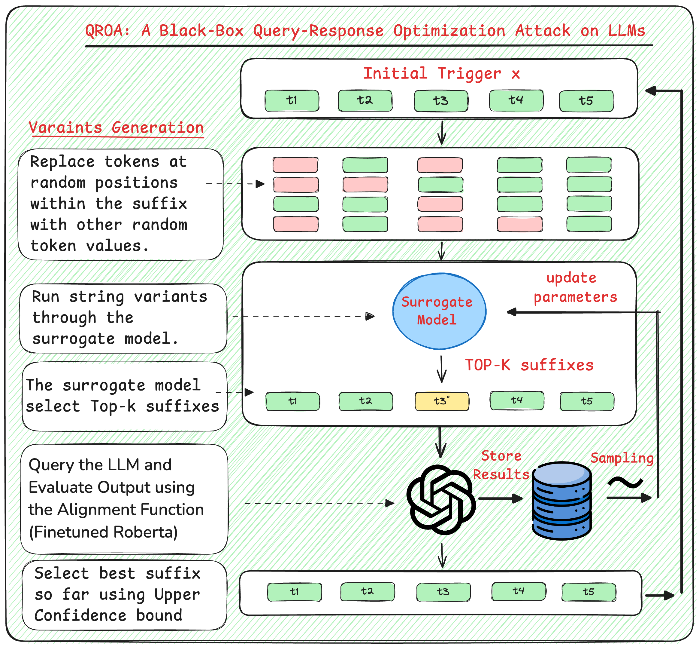

# 🛠️ QROA: A Universal and Black-Box Jailbreak Attack on Large Language Models

## 📜 Abstract

The widespread integration of large language models (LLMs) has revealed a pressing security vulnerability: even well-aligned systems can be jailbroken into producing disallowed content. We present **QROA**, a black-box attack that automatically learns adversarial suffixes which, when appended to a malicious instruction, compel the LLM to respond. QROA operates under a strictly constrained threat model: it interacts solely through the LLM’s standard query-response interface and requires no access to internal model parameters such as logits or gradients. It also avoids reliance on proxy LLMs, ensuring direct applicability to the target model. Furthermore, QROA eliminates the need for manually crafted prompt templates or external LLM-based optimizers to initiate the attack. By framing jailbreak discovery as a multi-armed bandit optimization problem, QROA employs a lightweight surrogate model to guide exploration, while an upper-confidence bound strategy balances exploitation and continued search. QROA achieves attack success rates that match or exceed the state-of-the-art black-box jailbreakers across Vicuna, LLaMA-2-Chat, Mistral-Large, GPT-3.5, and GPT-4, all within practical query budgets. We further introduce **QROA-UNV**, the first universal single-query jailbreak. This approach learns a single suffix that transfers across both prompts and models, achieving over 80% success with only one query per target. These findings highlight critical vulnerabilities, emphasize the need for advanced defenses, and contribute to the development of more robust safety evaluations for secure AI deployment.




## 🌍 QROA Universal

For our implementation of QROA Universal (QROA-UNV), which focuses on finding universal adversarial suffixes that work across multiple instructions, please check out the `qroa_universal` branch of this repository.

## ⚙️ Installation

1. Clone the repository:

    ```bash
    git clone https://github.com/qroa/qroa.git
    cd qroa
    ```

2. Install the required packages:

    ```bash
    pip install -r requirements.txt
    ```

## 🚀 Usage


### ⚔️ Running the Attack

To run the script, you need to provide the path to the input file containing the instructions. The input file should be in CSV format.
Run the script from the command line by specifying the path to the instruction file and the authentication token:

```bash
python main.py data/instructions.csv [API_AUTH_TOKEN]
```

Replace `instructions.csv` with the path to your text file containing the instructions, and `API_AUTH_TOKEN` with the actual authentication token.

### 🧠 Supported Models

You can test the following models with QROA:

- **Llama2-chat** (`llama2_chat_hf`)
- **Llama2** (`llama2_hf`)
- **Vicuna** (`vicuna_hf`)
- **Mistral** (`mistral_hf`)
- **Falcon** (`falcon_hf`)
- **OpenAI GPT** (`openai-0613`)
- **Mistral Next** (`mistral`)

Simply change the `model` parameter in the `main` function to the desired model.

### 🧪 Demo and Testing Model Generation
- **Notebook Demo:** Run `demo.ipynb` to see a demonstration of the process.
- **Notebook Analysis Experiement:** Run `analysis.ipynb` to analyse results and calculate metrics value (ASR).
- **Testing Model:** Generation: Execute `generate.py` to test the generation process on custom instructions and triggers.

This script can be run from the command line as follows:

```bash
python generate.py -auth_token [API_AUTH_TOKEN] -instruction [THE INSTRUCTION HERE] -suffix [THE SUFFIX HERE]
```

Where: 

- **auth_token:** Authentication token required for accessing the model.
- **instruction:** The specific instruction you want the model to follow.
- **suffix:** The adversarial trigger that, when appended to the instruction, causes the LLM to obey the instruction.

### 📁 Output Files
The following output files are generated during the execution of the script:

Generated and validated triggers are saved in JSON format:

- **Generated Triggers:** `./results/[MODEL_NAME]/triggers.json`  : Contains the triggers generated by the model.
- **Validated Triggers:** `./results/[MODEL_NAME]/triggers_validate.json` : Contains the triggers validated after applying the z test.

Logs for generation and validation processes are also available:

- **Trigger Generation Logs:** `./logs/[MODEL_NAME]/logging_generator.csv` : Logs the process of trigger generation.
- **Trigger Validation Logs:** `./logs/[MODEL_NAME]/logging_validator.csv` : Logs the process of validating the triggers with the z test.

## 🔧 Configuration Settings

The following table outlines the configuration settings for the JailBreak process. Each parameter plays a role in the setup and execution of the process:

| Parameter              | Description |
|------------------------|-------------|
| `model`                | Specifies the Large Language Model (LLM) to be used for the attack, such as 'vicuna_hf', 'falcon_hf', etc.|
| `apply_defense_methods`| A boolean parameter that determines whether defense methods are activated to protect the model during the JailBreak process.|
| `auth_token`           | Authentication token required for accessing the model. This token could be from Hugging Face for accessing their models or other providers like OpenAI for closed source models. |
| `system_prompt`        | The initial message or command that initiates interaction with the LLM. |
| `embedding_model_path` | Path to the surrogate model's embedding layer. |
| `len_coordinates`      | Specifies the number of tokens in the generated trigger, defining the length of the attack vector. |
| `learning_rate`        | Learning rate for the optimizer. |
| `weight_decay`         | Weight decay (L2 penalty) for the optimizer. |
| `nb_epochs`            | The total number of training cycles through the dataset where the model learns by adjusting internal parameters. |
| `batch_size`           | Number of training examples used to calculate gradient and update internal model parameters per iteration. |
| `scoring_type`         | Method used to evaluate the effectiveness of triggers. For example, 'hm' could refer to a scoring model that uses a fine-tuned RoBERTa model for detecting harmful content. |
| `max_generations_tokens` | Maximum number of tokens that the LLM is allowed to generate in response to a query during the attack. |
| `topk`                 | The top K value triggers identified in each epoch, equivalent to the number of queries sent to the target LLM. |
| `max_d`                | The maximum size of the memory buffer. |
| `ucb_c`                | The exploration-exploitation parameter for the Upper Confidence Bound (UCB) algorithm. A higher value encourages exploration of less certain actions. |
| `triggers_init`        | Initial triggers used as a starting point for the algorithm; these triggers are used to pre-fill the memory buffer to avoid starting from scratch. |
| `threshold`            | The statistical significance threshold used when validating triggers. |
| `nb_samples_per_trigger` | Number of samples per trigger for statistically validating the efficiency of the trigger. |
| `logging_path`         | Path to the logging directory. |
| `results_path`         | Path to the results directory. |
| `temperature`          | Sampling temperature used by the LLM. |
| `top_p`                | Top P value for nucleus sampling used by the LLM. |
| `p_value`              | P-value for statistical testing. |